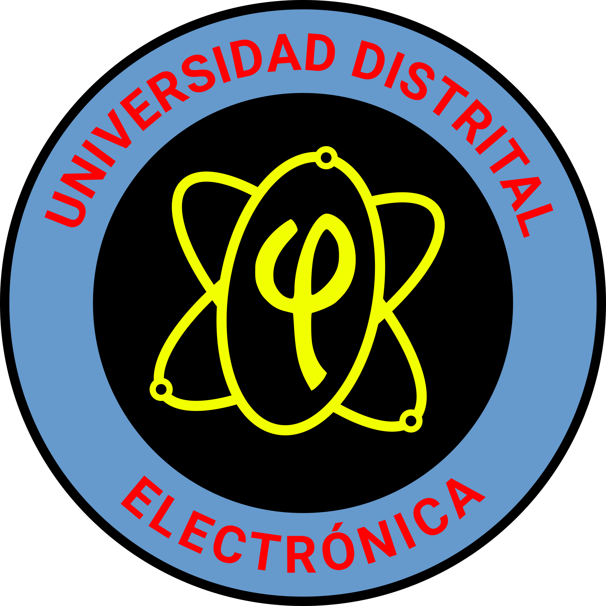

# LogoElectronicaUDistrital

Es una vectorización con software libre (inkscape) de uno de los logos de Ingeniera Electrónica de la Universidad Distrital Francisco José de Caldas (UDistrital) que encontré en la web. Espero no tener problemas legales por compartir la imagen en mejor calidad.

### Antiguo PNG

### SVG (Formato Vectorial)

### PNG 128X128 (Formato Mapa de Bits con Transparencia)

### PNG 512X512 (Formato Mapa de Bits con Transparencia)

### PNG 2048X2048 (Formato Mapa de Bits con Transparencia)

### JPG 128X128 (Formato Mapa de Bits Fondo Blanco)

### JPG 512X512 (Formato Mapa de Bits Fondo Blanco)

### JPG 2048X2048 (Formato Mapa de Bits Fondo Blanco)

### SVG (Formato Vectorial)

### PNG 128X128 (Formato Mapa de Bits con Transparencia)

### PNG 512X512 (Formato Mapa de Bits con Transparencia)

### PNG 2048X2048 (Formato Mapa de Bits con Transparencia)

### JPG 128X128 (Formato Mapa de Bits Fondo Blanco)

### JPG 512X512 (Formato Mapa de Bits Fondo Blanco)

### JPG 2048X2048 (Formato Mapa de Bits Fondo Blanco)

## Referencias
- http://www1.udistrital.edu.co:8080/web/ingenieria-electronica/mision-vision-objetivos
- http://www1.udistrital.edu.co:8080/image/image_gallery?uuid=dcf2e6f2-5ca5-43d6-9e67-8928d2f66bc6&groupId=4239044&t=1445618477098
